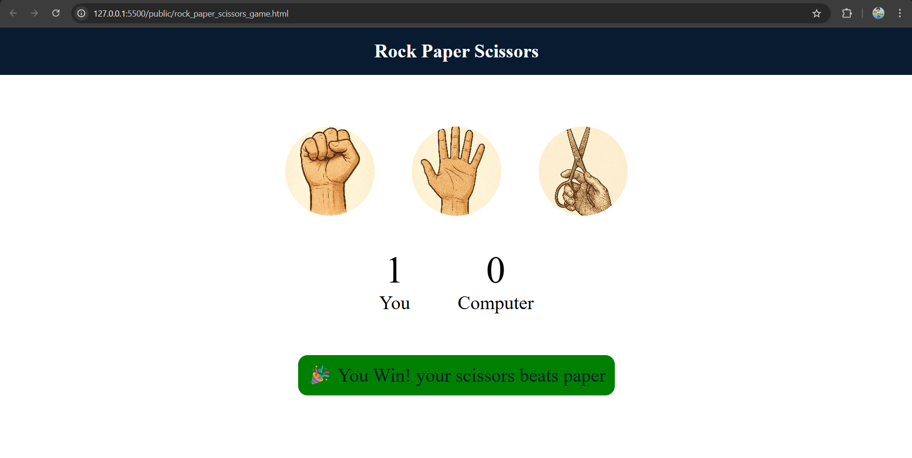

# ✊ Rock Paper Scissors Game  
*A classic interactive game built with HTML, CSS & JavaScript.*

---

## 🎯 Objective  
To recreate the classic **Rock, Paper, Scissors** game in the browser.  
This project is meant to practice DOM manipulation, game logic in JavaScript, and UI feedback.

---

## 🧩 Features  
- Player vs. computer rounds  
- Display of choices (rock / paper / scissors)  
- Display win / loss / tie result  
- Score counter for player and computer  
- Reset or restart game option  
- Responsive UI for desktop + mobile  

---

## 🧠 What I Learned  
- Writing game logic (if / else / switch)  
- Manipulating the DOM (showing/hiding elements, updating text)  
- Event listeners for user interaction  
- State management (scores, round results)  
- Clean UI styling and feedback  
- Responsive design with CSS  

---

## ⚙️ Technologies Used  
- HTML5  
- CSS3  
- JavaScript 

---

## 📸 Preview  
  
> *Gameplay screen showing player choice and results.*

---

## 🛠 How to Run Locally  

1. Clone your JS projects repo (or this part)  
   ```bash
   git clone https://github.com/sahilkadam078/HTML_CSS_JS_Mini_Project.git
