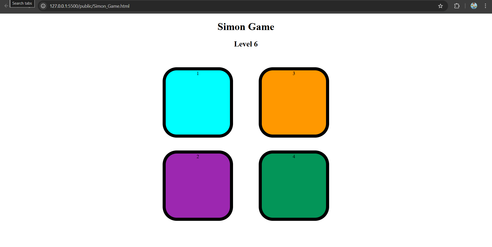

# 🎮 Simon Says Game  
*A pattern memory game built using HTML, CSS & JavaScript.*

---

## 🎯 Objective  
To build a **Simon Says-style memory game** where the user must follow a sequence of colors/sounds.  
This project practices **state tracking**, **event timing**, and **user feedback** in JavaScript.

---

## 🧩 Features  
- Displays a growing sequence of colors / buttons  
- User repeats the sequence by clicking  
- Indicates correct / wrong inputs  
- Score tracking / level display  
- Option to restart the game  
- Responsive layout for various screen sizes  

---

## 🧠 What I Learned  
- Handling asynchronous sequences (timeouts, delays)  
- Managing game state (current level, current sequence, user input)  
- DOM manipulation to show feedback (button highlights, sound)  
- Input validation (checking user sequence)  
- Combining HTML + CSS + JS to create an interactive game  

---

## ⚙️ Technologies Used  
- HTML5  
- CSS3  
- JavaScript (vanilla)

---

## 📸 Preview  
  
> *Game interface with color buttons and indication of level.*

---

## 🛠 How to Run Locally  

1. Clone or navigate to the `HTML_CSS_JS_Mini_Project` repo  
   ```bash
   git clone https://github.com/sahilkadam078/HTML_CSS_JS_Mini_Project.git
