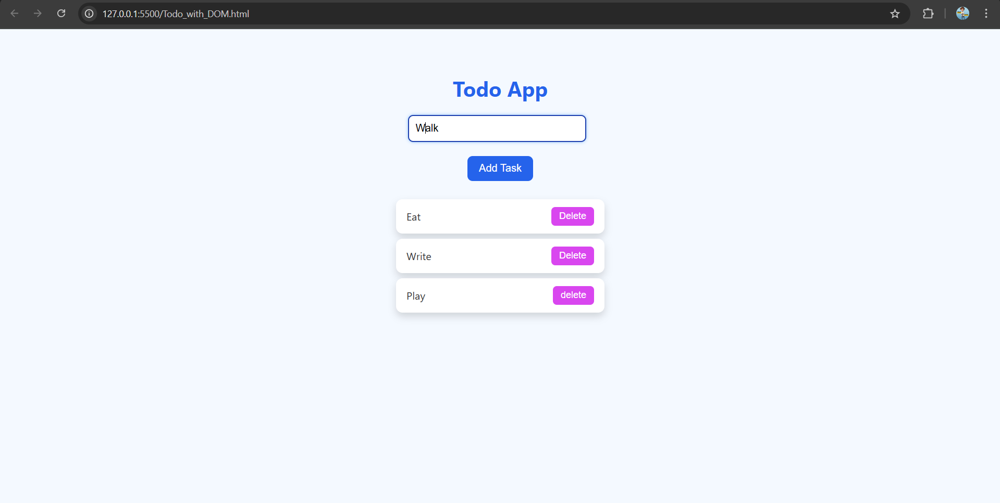

# ✅ To-Do App  
*A simple, interactive to-do list application built with HTML, CSS & JavaScript.*

---

## 🎯 Objective
To build a functional **to-do list application** using HTML, CSS, and vanilla JavaScript — focusing on DOM manipulation, event handling, and state persistence (if implemented).

---

## 🧩 Features
- Add new tasks  
- Mark tasks as completed / toggle status  
- Remove tasks  
- (Optional) Persist tasks in browser local storage  
- Responsive UI for desktop & mobile  

---

## 🧠 What I Learned
- Using JavaScript to manipulate the DOM  
- Event listeners & event delegation  
- State management in a web app  
- Persisting data locally (localStorage)  
- Combining HTML, CSS & JS for dynamic user experience  

---

## ⚙️ Technologies Used
- HTML5  
- CSS3  
- JavaScript 

---

## 📸 Preview
  
> *Clean UI with interactive to-do list functionality.*

---

## 🛠️ How to Run Locally
1. Clone the repo (or the parent `HTML_CSS_JS_Mini_Project`)  
   ```bash
   git clone https://github.com/sahilkadam078/HTML_CSS_JS_Mini_Project.git
